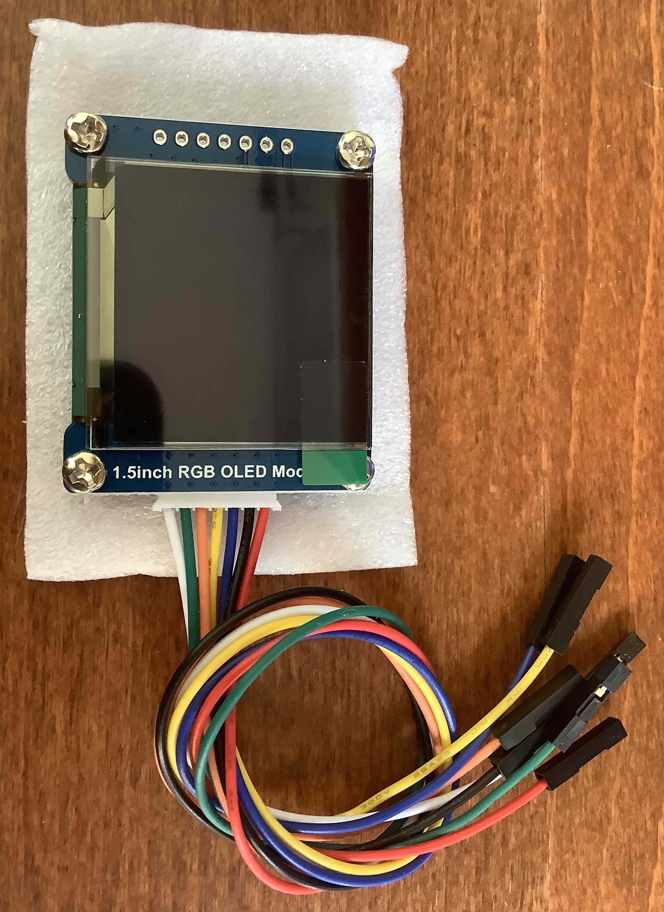
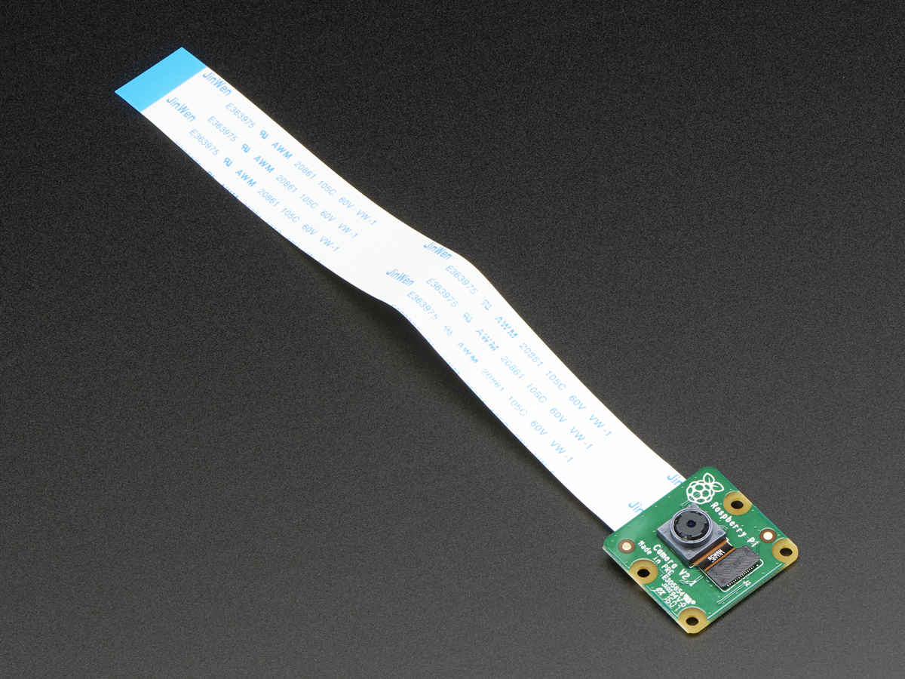
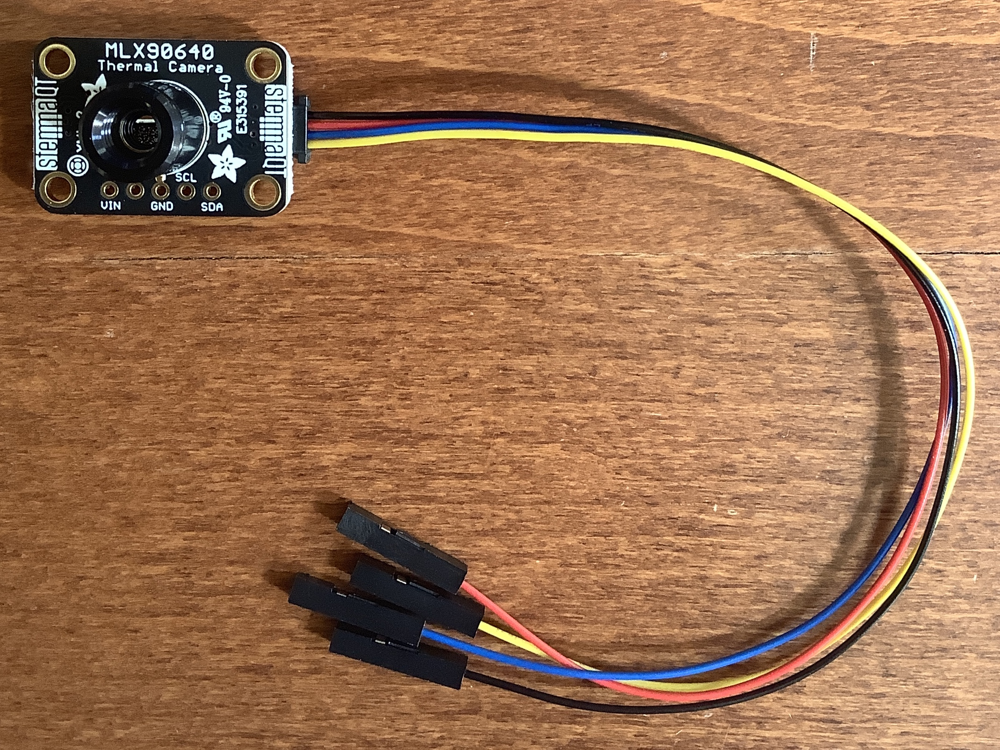
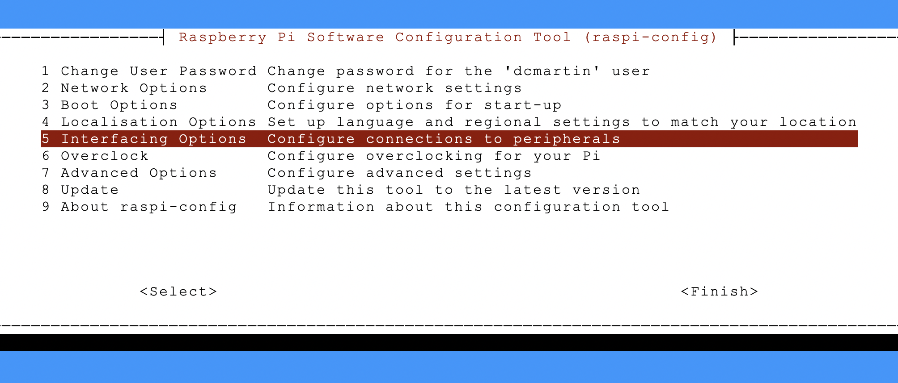
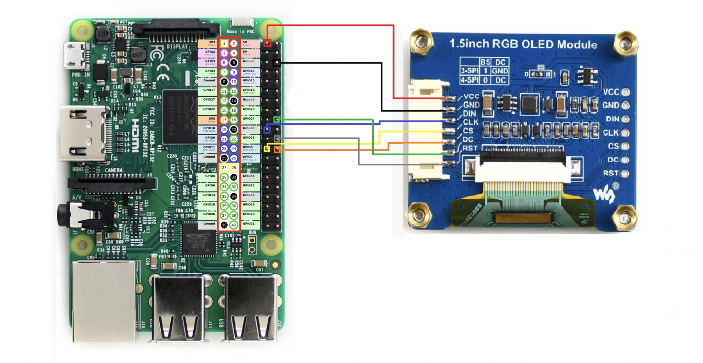
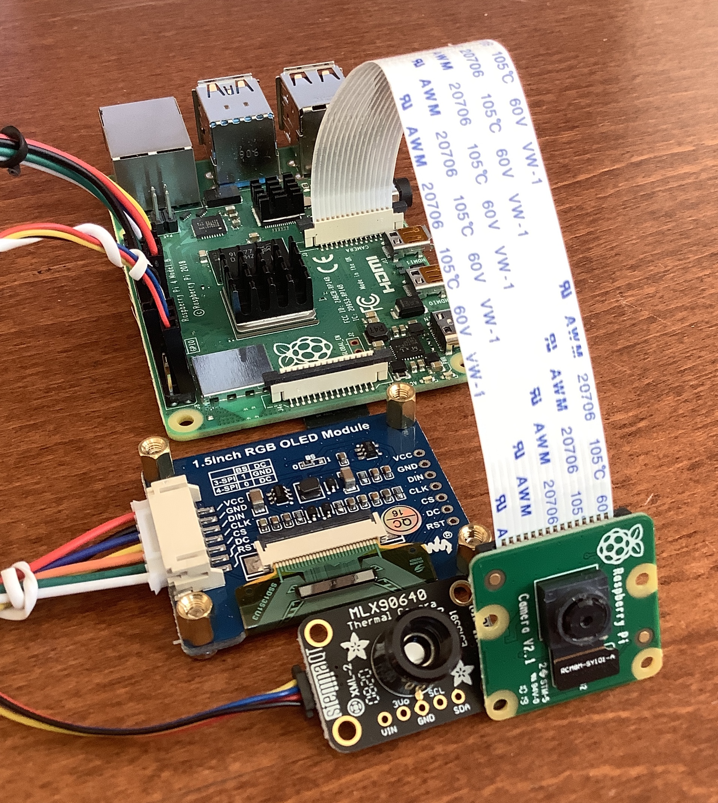

# &#x1F321; - `flir`
Perform facial detection and provide thermal measurement for humans.

2. Use `raspi-config` to enable `I2C` interface
6. Connect display, camera, and thermal sensor
3. Install `docker` and `git`
4. Clone this repository
5. Change directory and run `make`

## Parts

+ RaspberryPi Model 3/4
+ 1.5" RGB [OLED module](http://www.waveshare.net/wiki/1.5inch_RGB_OLED_Module); 3-pack at [Amazon](https://www.amazon.com/gp/product/B07DBXMFSN/ref=ppx_yo_dt_b_asin_title_o02_s00?ie=UTF8&psc=1)
+ `v2` [camera module](https://www.adafruit.com/product/3099)
+ `MLX90640` [IR thermal camera](https://www.adafruit.com/product/4407)
+ `STEMMA` [cable](https://www.adafruit.com/product/4397)





## Step 1 - Enable `I2C` interface
The serial connection may need to be enabled; use the `raspi-config` command-line program; for example:

```
% sudo raspi-config
```

A terminal-based interface will launch and provide menu options to enable the `I2C` interface; for example:



## Step 2 - Connect IR sensor
The thermal sensor connects to the `GPIO` pins on the RaspberryPi using a `STEMMA` cable to four (4) GPIO pins; these cable-pin connections are:

+ `VCC` - **RED** - 3.3V current; _recommended_ `PIN1`
+ `SDA` - **BLUE** - serial data; **required** `PIN3`
+ `SCL` - **YELLOW** - serial clock; **required** `PIN5`
+ `GND` - **BLACK** - ground; _recommended_ `PIN9`

   
##  Step 3 - Connect OLED display connection
The OLED display connects to the `GPIO` pins on the RaspberryPi using the provided cable.

Raspberry Pi|PIN|Color|LCD|
---|---|---|---|
3V|17|RED|VCC|	
GND|20|BLACK|GND|
MOSI|18|BLUE|DIN|	
SCLK|19|YELLOW|CLK|	
CE0|24|ORANGE|CS|	
GPIO24|18|GREEN|DC|
GPIO25|22|GRAY|RST|	



## Step 4 - Connect V2 camera module
Install the Raspberry Pi Camera module by inserting the cable into the Raspberry Pi. The cable slots into the connector situated between the Ethernet and HDMI ports, with the silver connectors facing the HDMI port.


## COMPLETE




